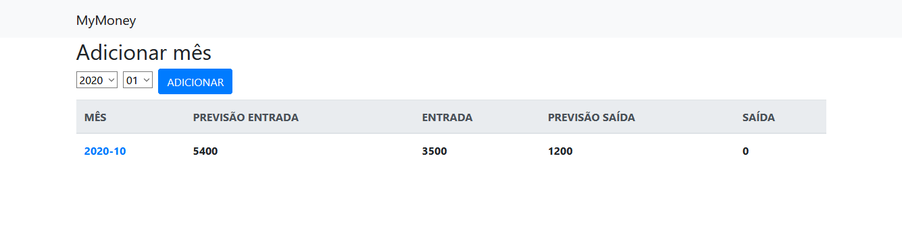
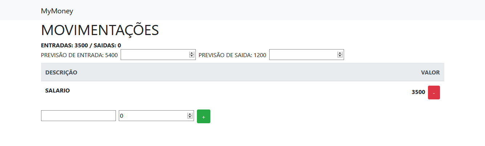

# MyMoney - DevPleno

[Acessar aplicação](https://mymoney-a586c.firebaseapp.com/)

## `Imagens`

## `Realtime Database`

## `Detalhes`

 Aprender conceitos de assincronismo em Javascript, novos conceitos como React Fragments e o hook useRef. Como criar uma Firebase Cloud Function e como publicar o projeto

- JS Basics: assíncronismo com Javascript, Callbacks, Promises e Async/Await
- Publicando o projeto no Firebase Hosting
- Firebase Cloud Function que reage a uma mudança no realtime database
- Hooks personalizados: usePost useDelete useGet
- Adicionando Bootstrap, navegação com React-Router-Dom
- Movimentações
- Adicionar e remover movimentação
- Validação de valor
- Hook useRef e criando um novo mês
- Mostrando meses
- Atualizando previsões / criando hook personalizado usePatch
- Usando Fragments e o useRef em React
